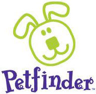

Title: My Projects

    <section class="centered ten columns">
        
Below is a list of some of the projects I have worked on in the past. To see more of my stuff, please visit 
        my <a href="https://github.com/aschleg">Github page</a>!

        <article class="valign row">
            

                
            

            

                <h2><a href="https://github.com/aschleg/poetpy">poetpy</a></h2>
                

                    The poetpy library is a Python wrapper for the 
                    <a href="http://poetrydb.org/index.html">PoetryDB API</a>. The library provides a Pythonic 
                    interface for interacting with and extracting information from the PoetryDB database. 
                

        </article>
        <article class="valign row">
            

                
            

            

                <h2><a href="https://github.com/aschleg/petpy">petpy</a></h2>
                

                    Petpy is a Python library that provides a convenient and easy to use interface 
                    for interacting with the <a href="https://www.petfinder.com/developers/api-docs">Petfinder API</a>.
                

        </article>
        <article class="valign row">
            

                
            

            

                <h2><a href="https://CRAN.R-project.org/package=Rpoet">Rpoet</a></h2>
                

                    The Rpoet package is a wrapper of the <a href="http://poetrydb.org/index.html">PoetryDB API</a> 
                    written in R. The PoetryDB API enables developers and other users to extract English-language 
                    poetry from nearly 130 poets. The package provides a simple R interface for interacting and 
                    accessing the PoetryDB database. <a href="https://github.com/aschleg/Rpoet">Github repo</a>.
                

        </article>
        <article class="valign row">
            

                
            

            

                <h2><a href="https://CRAN.R-project.org/package=PetfindeR">PetfindeR</a></h2>
                

                    R wrapper of the <a href="https://www.petfinder.com/developers/api-docs">Petfinder API</a> 
                    that implements methods for interacting with and extracting data from the Petfinder database.
                    <a href="https://github.com/aschleg/PetfindeR">Github repo</a>.
                

        </article>
    </section>

