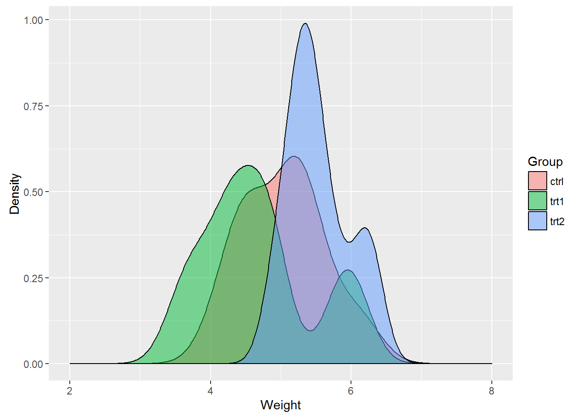
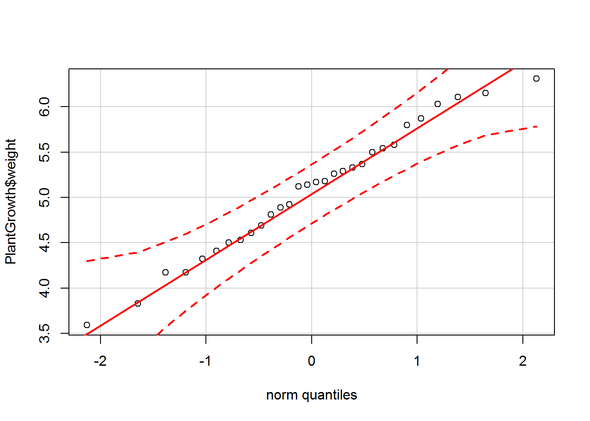

Title: Calculating and Performing One-way Analysis of Variance (ANOVA)
Date: 2018-07-20
Tags: R, statistics
Category: Statistics
Slug: calculating-performing-one-way-analysis-of-variance-anova
Author: Aaron Schlegel
Summary: ANOVA, or Analysis of Variance, is a commonly used approach to testing a hypothesis when dealing with two or more groups. One-way ANOVA, which is what will be explored in this post, can be considered an extension of the t-test when more than two groups are being tested. The factor, or categorical variable, is often referred to as the 'treatment' in the ANOVA setting. ANOVA involves partitioning the data's total variation into variation between and within groups. This procedure is thus known as Analysis of Variance as sources of variation are examined separately.

ANOVA, or Analysis of Variance, is a commonly used approach to testing a hypothesis when dealing with two or more groups. One-way ANOVA, which is what will be explored in this post, can be considered an extension of the t-test when more than two groups are being tested. The factor, or categorical variable, is often referred to as the 'treatment' in the ANOVA setting. ANOVA involves partitioning the data's total variation into variation between and within groups. This procedure is thus known as Analysis of Variance as sources of variation are examined separately.

The data is still assumed to be normally distributed with mean $\mu_i$ and standard deviation $\sigma_i^2$. Stating the hypothesis is also similar to previous examples when there were only two samples of interest. The hypothesis can be defined formally as:

$$ H_O : \mu_1 = \mu_2 = \cdots = \mu_k $$
$H_A$ : Not all population means are equal

Consider an experiment designed to test plant yields from a control and two different treatments. The returns of each group are collected, and the dry weights of the plants are measured. Is there a difference in the means of the treatments?

There is no reason to assume there is a difference between the control and the two treatments so the hypothesis for this example can, therefore, be stated as:

$$ H_0 : \mu_c = \mu_{t_1} = \mu_{t_2} $$
$H_A$ : At least one mean between the control and the two treatments is not equal.

First, start by loading the packages that will be needed to analyze the data as well as the dataset. The `PlantGrowth` dataset is available with base R.

``` r
library(ggplot2)
library(car)
```

    ## Loading required package: carData

``` r
data("PlantGrowth")
```

A histogram and Q-Q plot can be plotted to check for normality in the data.

``` r
ggplot(PlantGrowth, aes(PlantGrowth$weight)) + 
  geom_density(aes(data = PlantGrowth$weight, fill = PlantGrowth$group), position = 'identity', alpha = 0.5) +
  labs(x = 'Weight', y = 'Density') + scale_fill_discrete(name = 'Group') + scale_x_continuous(limits = c(2, 8))
```

    ## Warning: Ignoring unknown aesthetics: data



``` r
qqPlot(PlantGrowth$weight, col = PlantGrowth$group)
```



    ## [1] 14 16

The histogram shows the data have an approximate bell shape and from first glance, it does appear there are differences in the treatments. The Q-Q plot provides further evidence of normality as most of the points fall on the line.

Performing ANOVA in R
---------------------

Analysis of Variance is conducted on a model, typically a linear regression model. For this example, the linear regression step is outside the scope and will not be examined in detail. Note running the `lm()` function will output several of the statistics that are also found in the `anova()` output. ANOVA is conducted by using the `anova()` function with a nested `lm()` function.

``` r
plant.aov <- anova(lm(weight ~ group, data = PlantGrowth))
plant.aov
```

    ## Analysis of Variance Table
    ## 
    ## Response: weight
    ##           Df  Sum Sq Mean Sq F value  Pr(>F)  
    ## group      2  3.7663  1.8832  4.8461 0.01591 *
    ## Residuals 27 10.4921  0.3886                  
    ## ---
    ## Signif. codes:  0 '***' 0.001 '**' 0.01 '*' 0.05 '.' 0.1 ' ' 1

The p-value is far below 0.05, so the null is rejected, and it can be concluded there are differences between the treatment groups and the control.

Manually Calculating ANOVA
--------------------------

The `anova()` call above produced a table that is often referred to as the ANOVA table. The table contains the degrees of freedom, the sum of squares, the mean square, F-statistic and the p-value. As mentioned earlier, the ANOVA splits the data's variation into two sources which are in turn used to calculate the F-statistic. The F-statistic is determined by the F-test, which is done by dividing the variance between groups by the variance within groups. The sum of squares for treatments is defined as $SST$, for error as $SSE$ and the total $TotalSS$. The mean squares are calculated by dividing the sum of squares by the degrees of freedom.

Each sum of squares can be defined as:

$$ SST = \sum_{i=1}^k n_i(\bar{y_{i}} - \bar{y})^2 $$
$$ SSE = \sum_{i=1}^k (n_i - 1)s_i^2 $$
$$ TotalSS = \sum_{i=1}^k \sum_{j=1}^{n_i} (y_{ij} - \bar{y})^2 $$

With $k − 1$ treatment degrees of freedom, $n − k$ residual degrees of freedom. The mean squares are the sum of squares divided by the degrees of freedom.

$$ MST = \frac{SST}{k - 1} $$
$$ MSE = \frac{SSE}{n - k} $$

The F-statistic is defined as:

$$ f = \frac{MST}{MSE} $$

To conduct the F-test to find the F-statistic, $SST$ and $SSE$ and the corresponding degrees of freedom need to be found. The approach taken here is to split the data by group and use `lapply()` and `Reduce()` to calculate $SST$ and $SSE$. I'm sure there are a multitude of better and more efficient approaches.

``` r
plants <- split(PlantGrowth, PlantGrowth$group) # Split the data by group into a list

# The lapply function is then used to calculate the SST and SSE equation above for each group. The Reduce function applies a binary function to the elements in each list and is then summed.

sst <- sum(Reduce('+', lapply(plants, function(x) {
  length(x[,1]) * (mean(x[,1]) - mean(PlantGrowth$weight))^2
})))
sst
```

    ## [1] 3.76634

``` r
sse <- sum(Reduce('+', lapply(plants, function(x) {
  (length(x[,1]) - 1) * sd(x[,1])^2
})))
sse
```

    ## [1] 10.49209

``` r
# degrees of freedom
group_dof <- length(unique(PlantGrowth$group)) - 1
group_dof
```

    ## [1] 2

``` r
residual_dof <- length(PlantGrowth$weight) - length(unique(PlantGrowth$group))
residual_dof
```

    ## [1] 27

``` r
# Mean Squares
mst <- sst / group_dof
mst
```

    ## [1] 1.88317

``` r
mse <- sse / residual_dof
mse
```

    ## [1] 0.3885959

``` r
# F-statistic
f.value <- mst / mse
f.value
```

    ## [1] 4.846088

``` r
# p-value
p.value <- 1-pf(q = f.value, df1 = group_dof, df2 = residual_dof)
p.value
```

    ## [1] 0.01590996

A similar table to the output of the `anova()` function is then made with the values computed above.

``` r
plant.aov
```

    ## Analysis of Variance Table
    ## 
    ## Response: weight
    ##           Df  Sum Sq Mean Sq F value  Pr(>F)  
    ## group      2  3.7663  1.8832  4.8461 0.01591 *
    ## Residuals 27 10.4921  0.3886                  
    ## ---
    ## Signif. codes:  0 '***' 0.001 '**' 0.01 '*' 0.05 '.' 0.1 ' ' 1

| Source   | Df  | Sum Sq  | Mean Sq | F value | Pr(&gt;F) |
|----------|-----|---------|---------|---------|-----------|
| group    | 2   | 3.7663  | 1.8832  | 4.8461  | 0.01591   |
| residual | 27  | 10.4921 | 0.3886  |

All the elements of the manually calculated ANOVA table match the output of the `anova()` function.

Conclusion
----------

In this example, a hypothesis was tested with data from more than two treatments using One-way ANOVA. The reported ANOVA table from the `anova()` function was then replicated manually to verify the results. The test concluded there is a difference between the three treatments, however, nothing more than that is known. Which group is the most different from the others? How much do the two treatments defer from the control? Typically after performing a test involving more than two groups, post-hoc analysis is done to answer these questions.

References
----------

[Rencher, A. C. (2002). Methods of multivariate analysis. New York: J. Wiley.](https://amzn.to/39gsldt)